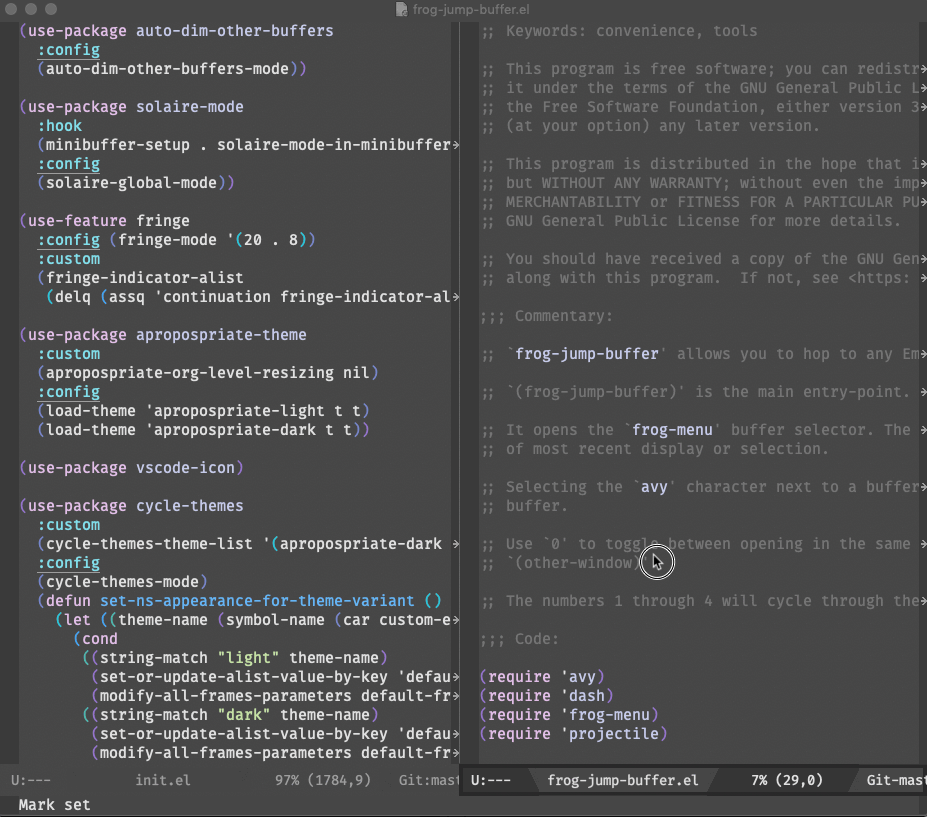

## Frog Jump Buffer

### Description

`frog-jump-buffer` is the fastest buffer-jumping Emacs lisp package
around. It is the spiritual successor to
[`ace-jump-buffer`](https://github.com/waymondo/ace-jump-buffer) and is
powered by [`avy`](https://github.com/abo-abo/avy) via
[`frog-menu`](https://github.com/clemera/frog-menu). Just like
`ace-jump-buffer`, it allows you to hop to any Emacs buffer in 2-3 key
strokes.

### Installation

This project isn’t in any recipe repositories yet, so you’ll need to
install it manually or directly from Github for now.

### Usage

#### `(frog-jump-buffer)`
This is the main entry-point. Bind it to your preferred key-binding.

It opens the `frog-menu` buffer selector. The buffers appear in order
of most recent display or selection.

Selecting the `avy` character next to a buffer switches to that
buffer.

Use `0` to toggle between opening in the same window or
`(other-window)`.

The numbers `1` through `4` will cycle through the default buffer filters.



Alternately, there is `(frog-jump-buffer-other-window)` if you would
like to be able `frog-jump-buffer` into `(other-window)` by default.

If you would like to call a function that uses a specific filter
function by default, you can do so like this:

``` emacs-lisp
(defun frog-jump-buffer-same-project ()
  (interactive)
  (frog-jump-buffer frog-jump-buffer-filter-same-project))
```

### Variables

#### `frog-jump-buffer-ignore-buffers`
This is a list of regexps of buffer names to ignore or buffer-matching
filter functions to use.

#### `frog-jump-buffer-max-buffers`
This is the maximum number of buffers to show in the `frog-menu`.  The
default is 12.

#### `frog-jump-buffer-filter-actions`
These are the built-in buffer filter actions available during
`frog-jump-buffer`.  Each action is a list of the form `(KEY
DESCRIPTION FILTER-FUNCTION)`. You can add additional buffer filters
like so:

``` emacs-lisp
(add-to-list
 'frog-jump-buffer-filter-actions
 '("5" "[special]" frog-jump-buffer-filter-special-buffers) t)
```
Each filter function receives a buffer as an argument and should
return a non-nil value if that buffer should be displayed in `frog-menu-buffer`.

The built-in filter functions, bound to `1`, `2`, `3`, `4` are:

*  `frog-jump-buffer-filter-same-project`
*  `frog-jump-buffer-filter-same-mode`
*  `frog-jump-buffer-filter-file-buffers`
*  `frog-jump-buffer-filter-all`

See `frog-menu-buffer.el` for more details.
